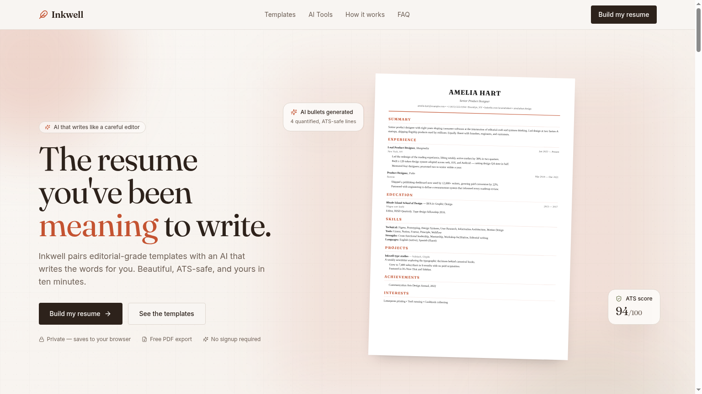

# Inkwell — AI Resume Builder

> Editorial-grade resumes, written with AI. Free, private, no signup.

Inkwell is a static, client-side resume builder that pairs six ATS-safe templates with an AI writing assistant. Build a resume, run an ATS audit, tailor it to a job description, generate a matching cover letter, and export a clean PDF — all without an account, and with your data living only in your browser.



---

## Highlights

- **AI bullet writer** — Quantified, ATS-friendly bullets from a role + company.
- **AI summary writer** — A confident, ~60-word professional summary.
- **Skill suggester** — Technical, soft, and tooling skills tuned to your role.
- **ATS compatibility check** — 0–100 score with concrete fixes and missing keywords.
- **JD tailoring** — Tuned summary + rewritten bullets against any job description.
- **Cover letter generator** — Three paragraphs, four tone presets, copy or download.
- **Project description writer** — Sharp project blurbs from a name + tech stack.
- **Six templates** — Classic, Modern, Minimal, Bold, Academic, Creative. All ATS-tested.
- **Live preview** — True-to-PDF A4 page that updates as you type.
- **Customization** — Five accent colors, three type sizes, toggle any section on/off.
- **PDF export** — Watermark-free A4 PDF, generated client-side.
- **JSON import / export** — Back up your resume, restore on any device.
- **Private by default** — No accounts. Resume data is persisted in `localStorage`.

## Tech stack

| Layer | Choice |
|-------|--------|
| Framework | React 18 + Vite 5 + TypeScript |
| Styling | Tailwind CSS v3 + shadcn/ui + custom design tokens |
| State | Zustand (with `persist` middleware → localStorage) |
| Routing | React Router |
| AI | Lovable AI Gateway (Gemini 2.5 Flash) via Supabase Edge Function |
| PDF | `html2pdf.js` (client-side) |
| Type / Fonts | Fraunces (display) + Inter (body) |
| Backend | Lovable Cloud (Supabase) — only used to host the AI proxy edge function |

## Getting started

```bash
# 1. Install
bun install        # or: npm install / pnpm install

# 2. Run the dev server
bun run dev        # http://localhost:8080

# 3. Build for production
bun run build
```

No `.env` setup is required for local development — the Supabase project URL and publishable key are auto-managed via Lovable Cloud and live in `.env`. AI calls go through the deployed edge function, which uses the `LOVABLE_API_KEY` configured on the cloud project.

## Project structure

```text
src/
├── pages/
│   ├── Index.tsx          Landing page (hero, features, comparison, CTA)
│   ├── BuilderPage.tsx    6-step builder + live preview
│   ├── TemplatesPage.tsx  Template gallery
│   └── ToolsPage.tsx      ATS check, JD match, cover letter, data backup
├── components/
│   ├── builder/           Step forms + Stepper
│   ├── preview/           ResumePaper + PreviewControls (template/color/sections)
│   ├── templates/         Six resume templates + ResumeRenderer
│   ├── layout/            Navbar + Footer
│   ├── tools/             Tool-specific bits
│   └── ui/                shadcn primitives
├── store/
│   └── useResumeStore.ts  Zustand store (persisted)
├── lib/
│   ├── resume-types.ts    Schema + sample data
│   ├── resume-text.ts     Resume → plain text (for ATS), JSON / TXT export
│   ├── ai-client.ts       Edge function wrapper
│   └── export-pdf.ts      A4 PDF generator
└── integrations/supabase/ Auto-generated client + types

supabase/functions/ai-resume/   Single edge function multiplexing all AI tasks
```

## How the AI works

All AI requests go through a single edge function (`supabase/functions/ai-resume`) that proxies to the Lovable AI Gateway. The function exposes one POST endpoint and dispatches on `task`:

| Task | Returns |
|------|---------|
| `bullets` | 4 ATS-friendly resume bullets |
| `summary` | A 3-sentence professional summary |
| `skills` | Technical / soft / tools categorized |
| `project_desc` | Project description + 3 highlight bullets |
| `education_achievements` | 3 short academic achievement lines |
| `ats` | Score (0–100) + issues + fixes + missing keywords |
| `jd_match` | Tailored summary + rewritten bullets + tips |
| `cover_letter` | Full cover letter text |

Each task uses OpenAI tool-calling for strict JSON output. The model is `google/gemini-2.5-flash` for speed and cost.

## Privacy

- Resume data is stored only in your browser's `localStorage` under the key `inkwell-resume-v1`.
- Closing the tab keeps it. Clearing browser data wipes it.
- The only network call that leaves your browser with resume content is when you **explicitly** click an AI button (and only the relevant fields are sent).
- No analytics, no accounts, no tracking.

## Roadmap

- LinkedIn URL import
- Multiple saved resumes per device
- DOCX export
- More templates (creative-portfolio, executive)
- Interview-question generator from your resume

## License

MIT — use it, fork it, ship your own.
